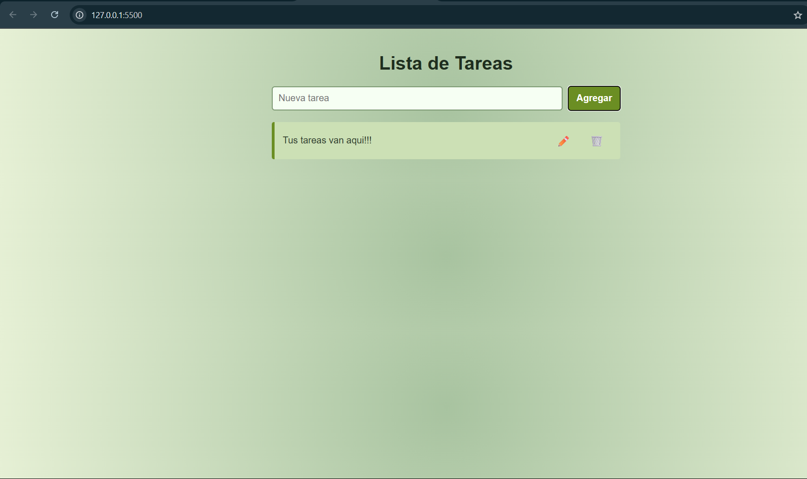

# 📝 Lista de Tareas

Una simple aplicación web para gestionar tareas, creada con **HTML**, **CSS** y **JavaScript puro**.

## 📸 Vista previa

 <!-- Puedes subir una imagen con ese nombre para que se vea -->

## 🚀 Funcionalidades

- Añadir nuevas tareas
- Editar tareas existentes
- Eliminar tareas
- Guardado automático en `localStorage`
- Interfaz amigable con diseño responsive y fondo con degradado verde pastel

## 🛠️ Tecnologías utilizadas

- HTML5
- CSS3 (con `linear-gradient` para el fondo)
- JavaScript (sin frameworks)

## 📂 Estructura del proyecto

📁 lista-de-tareas/
├── index.html
├── styles.css
├── script.js
└── README.md

## 🌐 Demo en línea

Si usas GitHub Pages, tu app estará disponible en: [text](https://TU_USUARIO.github.io/lista-de-tareas/)


> Reemplaza `TU_USUARIO` con tu nombre de usuario de GitHub.

## 🧪 Cómo usarlo localmente

1. Clona el repositorio:
   ```bash
   git clone https://github.com/TU_USUARIO/lista-de-tareas.git
2. Abre el archivo index.html en tu navegador.

👉 [Read this in English](README.en.md)
